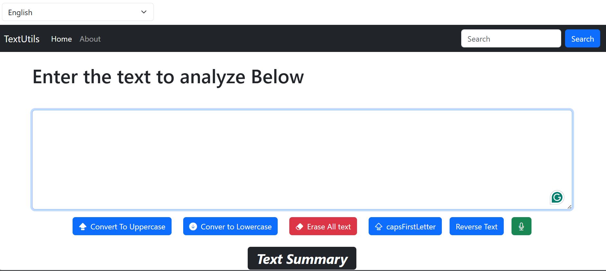

# TextUtils

TextUtils is a simple React-based text utility tool that allows users to manipulate and analyze text. It is a beginner-friendly project designed to showcase the use of React hooks, Bootstrap for UI, and basic JavaScript functionalities.

## Features

- Convert text to UPPERCASE
- Convert text to lowercase
- Clear the text
- Capitalize first letter of each word
- Count number of words and characters
- Preview of the text
- Text summary (character count, word count, estimated reading time)
- Reverse the text
- Speech-to-Text (dictation)

## Technologies Used

- React.js
- JavaScript
- Bootstrap 5
- HTML/CSS

## Setup Instructions

1. Clone the repository:

```bash
git clone https://github.com/VivekMishra21/textutils.git
```

2. Navigate to the project folder:

```bash
cd textutils
```

3. Install dependencies:

```bash
npm install
```

4. Start the development server:

```bash
npm start
```

The app will run on `http://localhost:3000`.

## Folder Structure

```
textutils/
├── public/
├── src/
│   ├── components/
│   ├── App.js
│   ├── index.js
│   └── ...
├── package.json
└── README.md
```

## Screenshots




## Future Enhancements

- Add multi-language support
- Add downloadable reports (PDF/Word)
- Add grammar/spell checker integration
